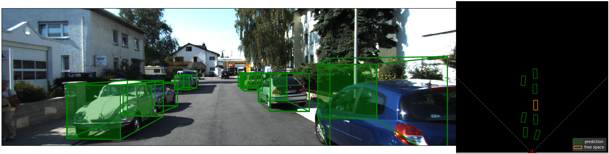

# Autonomous Parking Slot Detection System
## Goal
Locate a free space on the side of the road that is available for parking the specified car.  

This project implements paper "*3D Bounding Box Estimation Using Deep Learning and Geometry*" for predicting 3d location of a car based on 2d bounding box. (credit: https://github.com/lzccccc/3d-bounding-box-estimation-for-autonomous-driving)


## Structure
 - Output of ```predict.py``` is a file containing the information of location of a car in 3d space (orientation, translation, etc.)
 - To visualize and check the result, run ```visualization3Dbox``` (check **"Code Execution"** section for more info)
 - ```./utils``` is a folder containing auxiliary files, necessary for running different parts of the project.
 - ```./model``` is a folder containing different models that can be used.
 

## Weights
 - You can find pretraned model [here](https://www.kaggle.com/thedownhill/3d-box-cars-detection).

## Requirements:
- Python 3.6
- ```pip 20.0.2```
- Install the dependencies:
  - ```pip -r isntall ./requirements.txt```


## Results on KITTI raw data: 
VGG16 with ground truth 2D bounding box.


Video: https://www.youtube.com/watch?v=IIReDnbLQAE


## Code Execution
### Dataset Preparation
First prepare your KITTI dataset in the following format:
Create folder in root of project: `./tracklet`. And place `tracklet_labels.xml`, `calib_velo_to_cam.txt` and `calib_cam_to_cam.txt` from kitti dataset there.

*You can also change the path of tracklet directory in `my_config.py`*

### Training
To train:
1. Specify parameters in `config.py`.
2. run `train.py` to train the model:
```bash
python3 train.py
```

### Prediction
To predict:
1. Specify parameters in `config.py`.
2. run `prediction.py` to predict 3D bounding boxes. (predictions for each image are written to folder specified in `my_config`)
```bash 
python3 prediction.py
```

### Visualization
To visualize 3D bounding boxes from predicted files:
1. Specify parameters in `config.py`.
2. Run `visualization3Dbox.py`.
```bash
python3 visualization3Dbox.py
```

## Performance:
<table>
  <tr>
    <th colspan="4"></th> 
    <th colspan="3">w/o soft constraint</th>
    <th colspan="3">w/ soft constraint</th> 
  </tr>
  <tr>
    <th>backbone</th>
    <th>parameters / model size</th> 
    <th>inference time(s/img)(cpu/gpu)</th>
    <th>type</th>
    <th>Easy</th>
    <th>Mode</th>
    <th>Hard</th>
    <th>Easy</th>
    <th>Mode</th>
    <th>Hard</th>
  </tr>
  <tr>
    <td rowspan="4">VGG</td>
    <td rowspan="4">40.4 mil. / 323 MB</td> 
    <td rowspan="4">2.041 / 0.081</td>
    <td>AP2D</td>
    <td>100</td>
    <td>100</td>
    <td>100</td>
    <td>100</td>
    <td>100</td>
    <td>100</td>
  </tr> 
  <tr> 
    <td>AOS</td>
    <td>99.98</td>
    <td>99.82</td>
    <td>99.57</td>
    <td>99.98</td>
    <td>99.82</td>
    <td>99.57</td>
  </tr> 
  <tr> 
    <td>APBV</td>
    <td>26.42</td>
    <td>28.15</td>
    <td>27.74</td>
    <td>32.89</td>
    <td>29.40</td>
    <td>33.46</td>
  </tr> 
  <tr> 
    <td>AP3D</td>
    <td>20.53</td>
    <td>22.17</td>
    <td>25.71</td>
    <td>27.04</td>
    <td>27.62</td>
    <td>27.06</td>
  </tr> 
  
  <tr>
    <td rowspan="4">mobileNet v2</td>
    <td rowspan="4">2.2 mil. / 19 MB</td> 
    <td rowspan="4">0.410 / 0.113</td>
    <td>AP2D</td>
    <td>100</td>
    <td>100</td>
    <td>100</td>
    <td>100</td>
    <td>100</td>
    <td>100</td>
  </tr>
  <tr> 
    <td>AOS</td>
    <td>99.78</td>
    <td>99.23</td>
    <td>98.18</td>
    <td>99.78</td>
    <td>99.23</td>
    <td>98.18</td>
  </tr> 
  <tr> 
    <td>APBV</td>
    <td>11.04</td>
    <td>8.99</td>
    <td>10.51</td>
    <td>11.62</td>
    <td>8.90</td>
    <td>10.42</td>
  </tr> 
  <tr> 
    <td>AP3D</td>
    <td>7.98</td>
    <td>7.95</td>
    <td>9.32</td>
    <td>10.42</td>
    <td>7.99</td>
    <td>9.32</td>
  </tr>  
</table>  
Offline Evaluation: 50% for training / 50 % for testing <br>
cpu: core i5 7th <br>
gpu: NVIDIA TITAN X
